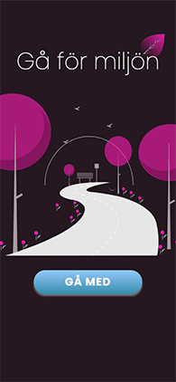

# __GÅ FÖR MILJÖN__

----
 

## 🖥️ &nbsp; __GitHub Info__
 

 &nbsp;  &nbsp; 

---
 

## 📖 &nbsp; __Table of Contents__

- [Description](#🌐-description)
- [Resources](#🧰-resources)
- [Preview](#👀-preview)
- [License](#📄-license)
- [My Socials](#😎-my-socials)

---
 

## 🌐 &nbsp; __Description__

## Gå för miljön - Walk for the enviroment

This is a project from school were we had to implement a simple UX-design into a "working" UI (mvp), implementing only the most basic, like the design, routing and some effects. 

My UI was made specifically for larger newer smart phones (iphone 12 pro).

It was made with the intent of creating a way for people to make the choise of walking instead of taking the car to nearby places. This way yhe users steps was going to be count and that way they get points that transform to money that they can use to donate to one of three organisations that work for creating a better enviroment.

 

[Back To The Top](#read-me-template)

---
 

## 🧰 &nbsp; __Resources__

### Made with [ReactJS](https://reactjs.org/)

- [react-icons](https://react-icons.github.io/react-icons/)
- [react-countup](https://www.npmjs.com/package/react-countup)
- [styled-components](https://styled-components.com/)
- [react-router-dom](https://reactrouter.com/web/guides/quick-start)

 

[Back To The Top](#read-me-template)

---
 

## 👀 &nbsp; __Preview__

 &nbsp;&nbsp; &nbsp;&nbsp;  &nbsp;&nbsp;  &nbsp;&nbsp;  &nbsp;&nbsp;  &nbsp;&nbsp;  &nbsp;&nbsp;  &nbsp;&nbsp;  

 

[Back To The Top](#read-me-template)

---
 

## 📄 &nbsp; __License__

 

MIT License

 

Copyright (c) [2017] [James Q Quick]

Permission is hereby granted, free of charge, to any person obtaining a copy
of this software and associated documentation files (the "Software"), to deal
in the Software without restriction, including without limitation the rights
to use, copy, modify, merge, publish, distribute, sublicense, and/or sell
copies of the Software, and to permit persons to whom the Software is
furnished to do so, subject to the following conditions:

The above copyright notice and this permission notice shall be included in all
copies or substantial portions of the Software.

THE SOFTWARE IS PROVIDED "AS IS", WITHOUT WARRANTY OF ANY KIND, EXPRESS OR
IMPLIED, INCLUDING BUT NOT LIMITED TO THE WARRANTIES OF MERCHANTABILITY,
FITNESS FOR A PARTICULAR PURPOSE AND NONINFRINGEMENT. IN NO EVENT SHALL THE
AUTHORS OR COPYRIGHT HOLDERS BE LIABLE FOR ANY CLAIM, DAMAGES OR OTHER
LIABILITY, WHETHER IN AN ACTION OF CONTRACT, TORT OR OTHERWISE, ARISING FROM,
OUT OF OR IN CONNECTION WITH THE SOFTWARE OR THE USE OR OTHER DEALINGS IN THE
SOFTWARE.

 

[Back To The Top](#read-me-template)

---
 

## 😎 &nbsp; __My Socials__

- Instagram - [@jonepredator](https://instagram.com/jonepredator)
- Portfolio Website - [Juan Fuenzalida](https://juanfuenzalida.netlify.app)
- Github - [Jonepredator](https://github.com/Jonepredator)
- Linkedin - [Juan Fuenzalida](https://www.linkedin.com/in/juan-fuenzalida-2b90321b6/)

 

[Back To The Top](#read-me-template)